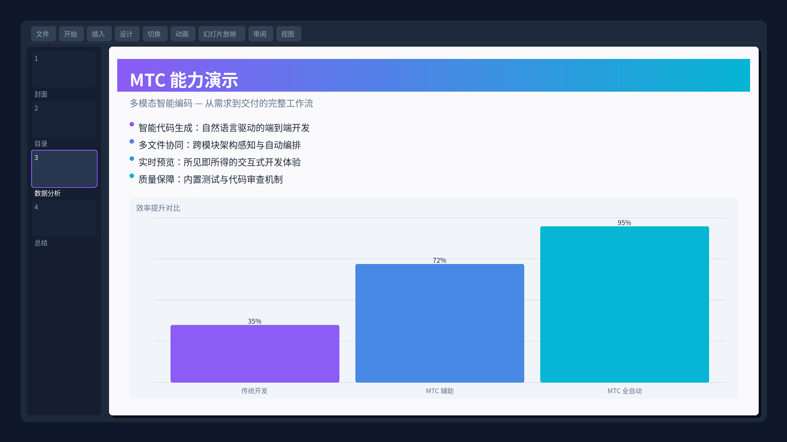
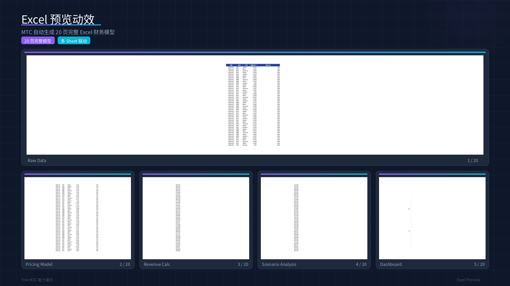

# Trae MTC 能力梳理及演示

多模板协作 · 全栈文档能力 —— Excel武器库 + PPT演示 + 3D交互仪表盘。

## 作品渲染

| Excel复杂模型 | PPT能力演示 | 3D交互仪表盘 |
|:---:|:---:|:---:|
|  |  |  |

| Excel预览动效 | 综合能力展示 |
|:---:|:---:|
|  |  |

## 工作流

1. **需求与能力梳理** — project_context外置上下文体系
2. **Excel武器库** — 多表联动 + 质量门禁 + 下拉控件
3. **PPT演示制作** — 嵌入动效/音效/3D旋转
4. **交互式仪表盘** — 3D可交互HTML可视化

## 技术栈

`Trae SOLO` `MTC模式` `Excel` `PptxGenJS` `Three.js` `HTML`
