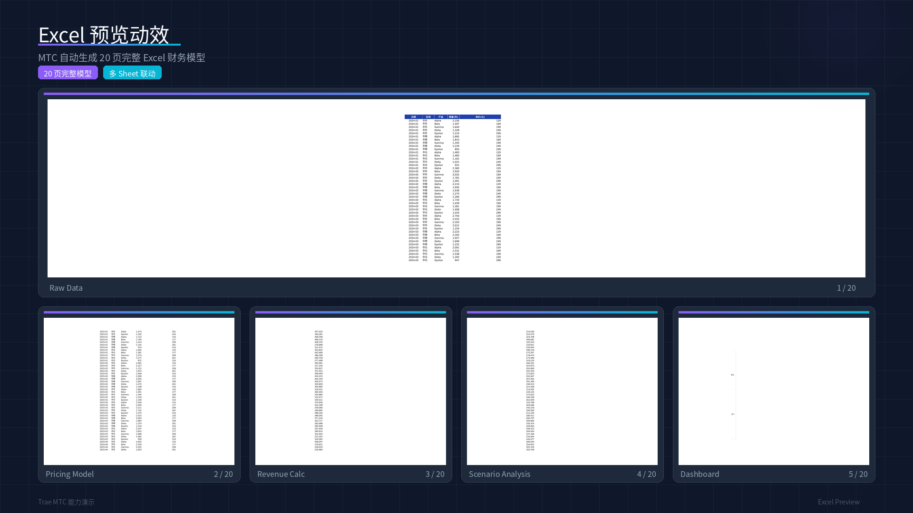

# Trae MTC 能力梳理及演示

一组展示 Trae SOLO 的 MTC（More Than Code）工作方式的文档作品：Excel 复杂模型、PPT 演示稿与可交互 HTML 仪表盘。适合想直接体验多格式产物的读者，也可作为文档工程和协作流程的学习示例。

## 快速体验

1. 打开 [MTC_复杂Excel模型.xlsx](MTC_复杂Excel模型.xlsx)，进入 `Analysis` Sheet，通过区域、情景、产品下拉框查看联动。
2. 打开 [MTC_能力演示.pptx](MTC_能力演示.pptx) 查看演示稿。
3. 下载仓库后，在浏览器打开 [3D_可交互销售仪表盘.html](interactive/3D_可交互销售仪表盘.html)。保留目录结构，以便相对路径引用素材。

详细操作与 Office for Mac 超链接兼容性说明见 [00_README.md](00_README.md)；实现背景、模型结构与后续方向见 [README_DEV.md](README_DEV.md)。

## 作品渲染

| Excel复杂模型 | PPT能力演示 | 3D交互仪表盘 |
|:---:|:---:|:---:|
|  |  |  |

| Excel预览动效 | 综合能力展示 |
|:---:|:---:|
|  |  |

## 内容与工作流

- 需求与能力梳理：`project_context/` 记录需求、证据来源与能力边界。
- Excel：多表联动、质量门禁、下拉控件与说明页。
- PPT：演示图片、动效/音效与相关产物入口。
- HTML：交互式 3D 仪表盘；相关素材位于 `assets/`。

技术与产物：`Trae SOLO`、`MTC模式`、`Excel`、`PptxGenJS`、`Three.js`、`HTML`。

## 状态与限制

这是作品与演示资料仓库，未提供自动构建脚本或独立 Release。下载现有文件即可开始阅读。工作簿和演示稿的交互效果受 Office 版本与平台影响；原说明已记录 Mac 文件超链接差异，请按使用说明排查。

演示中的能力点用于说明这些作品，不代表 Trae、Excel 或其他工具在所有任务与版本中的能力保证。

## 反馈、署名与许可

欢迎通过 Issue 或 Pull Request 提交文件打不开、相对链接失效或说明不清的问题，并注明使用软件、版本及复现步骤。仓库文档由 [Ming-Sir-69](https://github.com/Ming-Sir-69) 维护。

当前未见覆盖整仓库的 LICENSE/NOTICE。作品与素材的再分发、商用和改编范围待确认；本文不新增授权，也不改变第三方素材及工具的权利归属。
